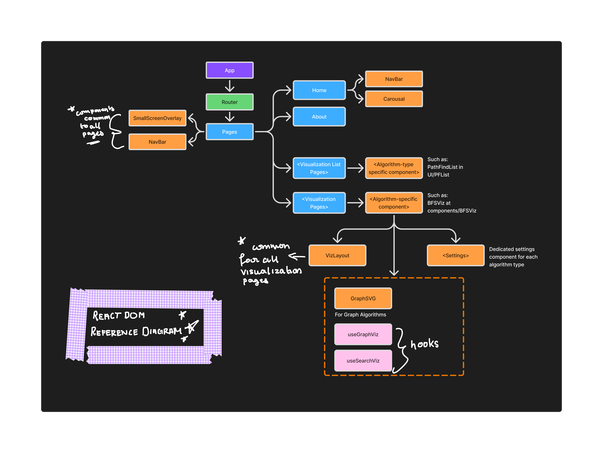

# Algorithm Visualizer Application (Updated)

The Algorithm Visualizer Application's main goal is as the name suggests - to visualize algorithms. The purpose can be detailed as follows:
> "To visualize an algorithm step-by-step to make complex algorithm's inner workings easy to understand."

This application in it's current form is an MVP with the simplest form of visualizations, and the `main focus` of this project is not only to add more algorithms to this application, but also to make the visualizations clearer, easier to understand and accessible to everyone. 

## Tech Stack

### Frontend
- React 18
- React Router v6
- Axios
- Bootstrap 5 and React Bootstrap
- animate.css
- Sass (CSS preprocessor)

### Backend

- Django 5.2
- Django REST Framework
- Django Channels
- django-cors-headers
- SQLite
- Gunicorn

### Deployment
- Vercel (For Frontend Deployment)
- Render (For Backend Deployment)

## Setup Instructions

1) Clone the repository:
   ```bash
   git clone <repository_url>
   cd algovizXX
   ```
2) Set up the backend:
   - Copy `requirements.txt` into the `algovisual` directory if not already present. It will be present in the main directory.
   ```bash
    cd algovisual
    python -m venv venv
    venv/bin/activate  
    pip install -r requirements.txt
    python manage.py migrate
    python manage.py runserver
   ```

3) Set up the frontend:
   ```bash
    cd ../frontend
    npm install
    npm start
   ```

## Project Structure

```
algovizXX/
├── package.json
├── README.md
├── algovisual/
│   ├── db.sqlite3
│   ├── manage.py
│   ├── requirements.txt
│   ├── algorithms/
│   │   ├── __init__.py
│   │   ├── admin.py
│   │   ├── apps.py
│   │   ├── models.py
│   │   ├── tests.py
│   │   ├── urls.py
│   │   ├── views.py
│   └── algovisual/
│       ├── asgi.py
│       ├── settings.py
│       ├── urls.py
│       ├── wsgi.py
└── frontend/
    ├── package.json
    ├── README.md
    ├── public/
    │   ├── index.html
    │   ├── manifest.json
    │   ├── robots.txt
    │   ├── images/
    │   └── js/
    │       └── p5.min.js
    └── src/...
        ├── components/...
        │   └── UI/...
        │       └── styles/...
        ├── utils/
        └── pages/...
```

## React Frontend

The following diagram provides a general visualization of the React DOM tree that can serve as a reference to the overall frontend structure.



The above diagram follows the following color coding for each element.

🟣 - Root that mounts global providers such as theme, and the pages in this application. <br>
🔵 - Pages, all pages have Navbar and SmallScreenOverlay as common children. <br>
🟠 - Components. <br>
🟢 - Router. <br>
🩷 - Hooks.

## Architecture

AVA follows a `Decoupled Single Page Application (SPA) architecture`. The React frontend is separated from the Django backend, and the react frontend proxies API calls to the django backend.

## Deployed Link

https://algoviz-xx.vercel.app/

## Upcoming Features
- Speed control for visualizations,
- Tree algorithms.
- Clearer visualizations with more detailed explanations of each step.
- User authentication.
- Custom input for algorithms.
- Pseudocode display and tracing as the visualization plays.
- AI integration.


## Rough notes for Reference
### Reusable SVG graph renderer for pathfinding visualizations.
  Props:
    nodes       - [{id, x, y}]
    edges       - [{from, to, weight?}]
    visited     - [id, ...]
    current     - id | null
    pathEdges   - [{from, to}]  highlighted path/tree edges
    activeEdge  - {from, to} | null  currently relaxing edge
    showWeights - bool
 